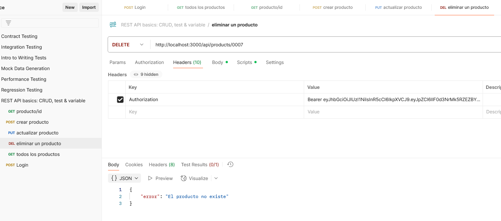
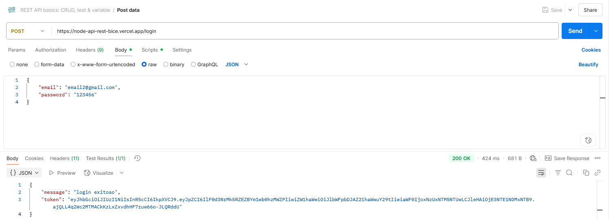
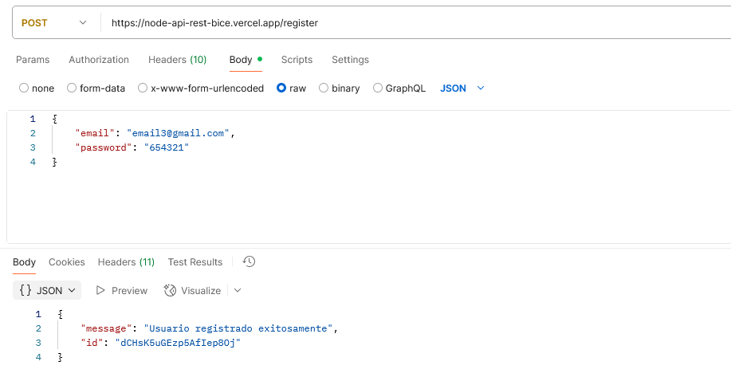
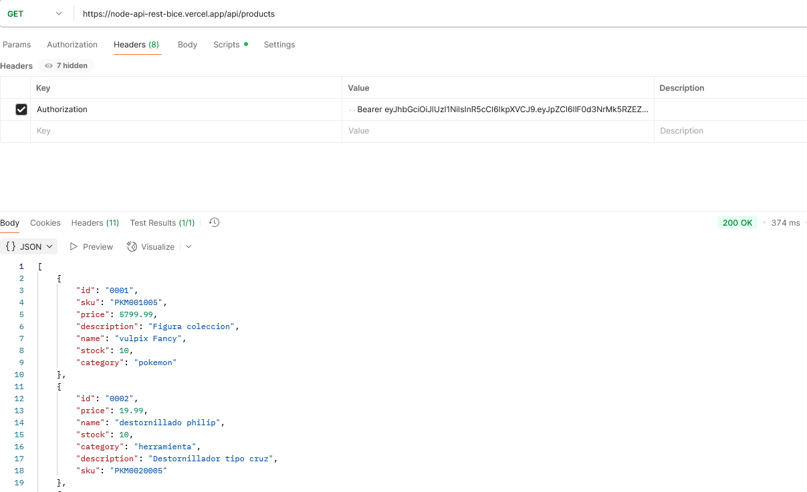
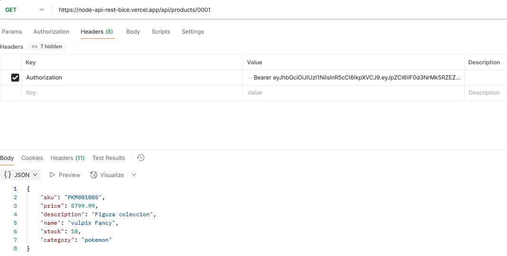
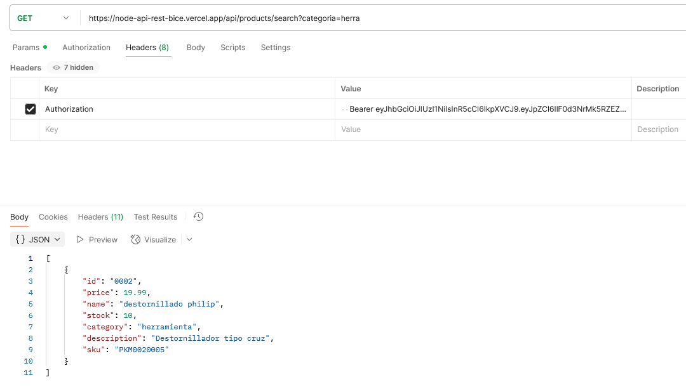
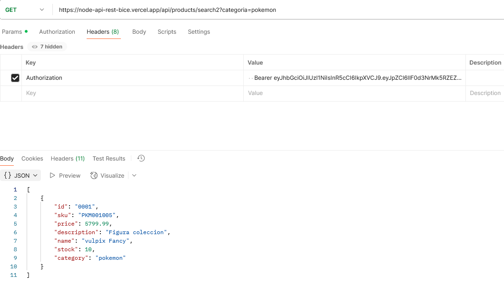
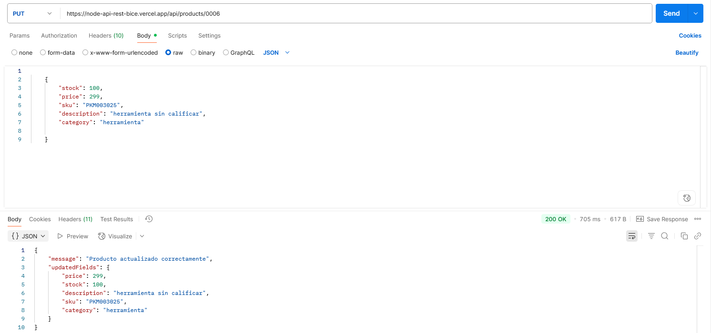
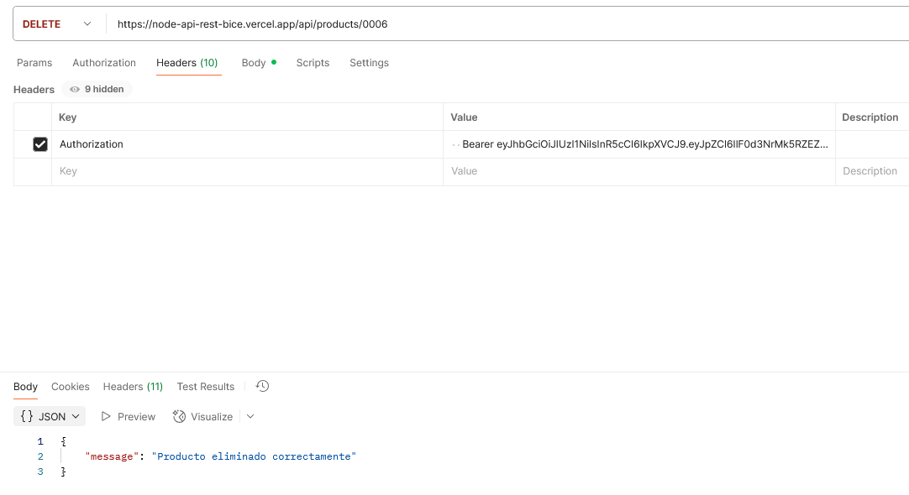

# API Rest en Node.js

#el siguiente comando es para darle permiso a node maquina local con windows 10
Set-ExecutionPolicy -Scope Process -ExecutionPolicy Bypass

consignas del trabajo practico final
Premisa:

Actualmente nuestro cliente tiene diversos productos en catálogo y precisa disponer de una API Rest desde donde su tienda oficial pueda administrarlos, habilitando la posibilidad de Leer, Crear, Actualizar y Eliminar la información sobre los productos.

La aplicación debe contar con una capa de autenticación para resguardad la seguridad de los datos que estarán alojados en una base de datos en la nube mediante el servicio Firestore de Firebase.

Finalmente, la aplicación debe contemplar el manejo de errores de forma clara, teniendo en cuenta fallos del tipo 404 para rutas no definidas, los estados 401 y 403 ante errores de autenticación y códigos de estado 400 y 500 cuando las peticiones contienen errores o nuestros servicios externos de datos no responden.

#1:
1) Crea un directorio donde alojarás tu proyecto e incluye un archivo index.js como punto de entrada. //ok
2) Inicia Node.js y configura npm usando el comando npm init -y. // ok
3) Agrega la propiedad "type": "module" en el archivo package.json para habilitar ESModules. //ok
4) Configura un script llamado start para ejecutar el programa con el comando npm run start. // ok

#2: Instalación de dependencias
Instala express npm -i express 
instalar cors npm i cors
instalar body-parser npm i body-parser //como uso "express": "^5.1.0", ya esta integrado
instalar dotenv, 
instalar firebase npm i firebase
instalar jsonwebtoken como dependencias del proyecto. npm i jsonwebtoken bcryptjs

#3: Configuración del servidor
Crea un servidor web con express y realiza su configuración en el archivo index.js.
Configura CORS para habilitar las peticiones de origen cruzado, así las aplicaciones Frontend de la empresa pueden consultar al servicio sin problemas.//ok
Configura el middleware global de body-parser para interpretar los body en formato JSON de las peticiones.
Establece un middleware que maneje las rutas desconocidas, devolviendo el estado 404 y un mensaje.
Crea un archivo .env donde se alojarán las variables de entorno del proyecto.

#4: Rutas
Crea la capa de rutas del proyecto.
Establece las rutas necesarias para atender las peticiones que interactúan con productos, así como también la ruta de login para autenticar usuarios:
products.routes.js:
GET /api/products devuelve todos los productos.
GET /api/products/:id devuelve el producto con el ID indicado.
POST /api/products/create recibe en el cuerpo (body) de la petición la información sobre el nuevo producto para ser guardado en el servicio de datos en la nube.
DELETE /api/products/:id elimina el producto con el ID indicado.
auth.routes.js:
POST /auth/login recibe las credenciales de usuario en el cuerpo (body) de la petición y devuelve el Bearer token si son válidas o un error de autenticación en caso contrario.

#5: Controladores y Servicios
Crea la capa de controladores para cada una de las rutas establecidas en el requerimiento anterior.
Crea la capa de servicios para atender a cada uno de los controladores.

#6: Acceso a los datos
Crea la capa de modelos de la aplicación.
Crea un nuevo proyecto de Firestore en Firebase, agrega una colección para registrar nuevos productos y crea el primer documento de producto para darle estructura y tipos de datos.
Configura y conecta Firebase en el proyecto.
Utiliza la instancia de Firebase creada y crea los métodos necesarios para que el modelo pueda interactuar con la base de datos remota.
Conecta los servicios con los modelos.

#7: Protege tus rutas
Configura JWT en el proyecto
Crea un middleware de autenticación y protege las rutas correspondientes
Agrega la lógica necesaria en la en controlador de login para validar la identidad del usuario y devolver un Bearer Token.

email = email2@gmail.com 
clave = 123456
en cada peticion get, post etc copiar el token para luego en el headers key:Authorization value=Bearer token

formato de los datos en firebase

    {
        "id": "0001",
        "sku": "PKM001005",
        "category": "pokemon",
        "name": "vulpix Fancy",
        "price": 5799.99,
        "stock": 10,
        "description": "Figura coleccion"
    }
    

vista de postman local haciedo las distintas peticiones

funionalidad del search
Trae todos los productos de Firestore.
Filtra en memoria los productos que coincidan con:

categoria → parcial, insensible a mayúsculas.

descripcion → parcial, insensible a mayúsculas.

Si no se envían filtros, devuelve todos los productos.
Comparación flexible tipo "contiene", ideal para búsquedas de texto.

Ventaja
    Permite búsquedas parciales e insensibles a mayúsculas, aunque no lo soporta Firestore directamente.

Desventaja
    Si la colección es muy grande, traer todos los documentos puede ser lento y costoso.

dominio vercel = https://node-api-rest-bice.vercel.app/

